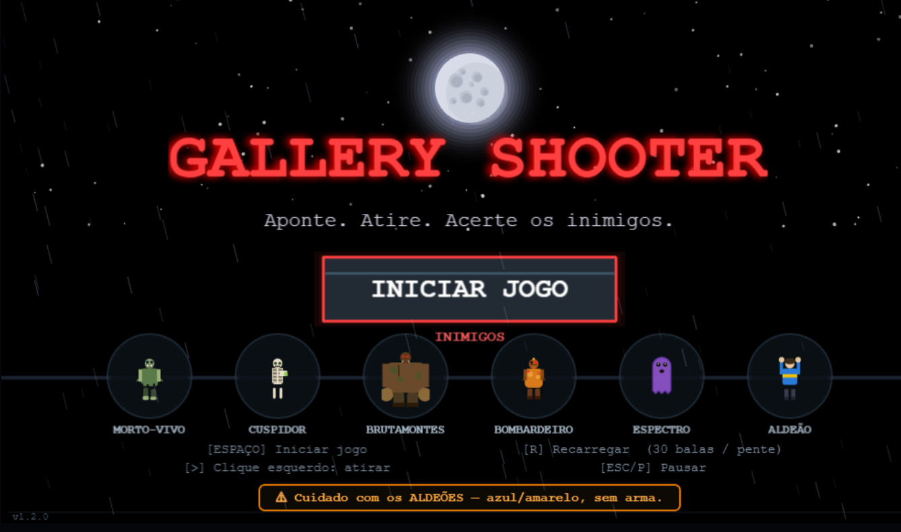

# 🎯 GALLERY SHOOTER

Jogo de tiro ao alvo (shooting gallery) em **arquivo único** — Phaser 3 + Web Audio. Sem build, sem dependências locais. Abre o `index.html` no navegador e joga.



## ▶️ Como rodar

```bash
# qualquer servidor estático serve; ou só abra o arquivo direto
python3 -m http.server 8000
# acesse http://localhost:8000
```

Requer conexão com internet apenas para carregar o Phaser 3 via CDN:
`https://cdn.jsdelivr.net/npm/phaser@3/dist/phaser.min.js`

## 🎮 Controles

| Ação | Tecla / Mouse |
|------|---------------|
| Mirar | Mouse (move) |
| Atirar | Botão esquerdo |
| Recarregar | `R` (auto-recarrega ao tentar atirar sem munição) |
| Pausar / retomar | `ESC` ou `P` |

## 🕹️ Objetivo

Sobreviva o máximo possível em um modo **endless** de rodadas infinitas (`MAX_ROUNDS = 999`). Cada rodada cresce em dificuldade: mais inimigos, spawn mais rápido, HP maior e novos tipos de monstros aparecem. Alcance a maior pontuação possível — combo multiplica os pontos, e a cada **10.000 pontos** você ganha um **continue**.

> ⚠️ **Cuidado com os Aldeões** — atirar em civis zera o combo, penaliza score/HP e, após 5 abatidos, é game over. A quantidade de inocentes por rodada cresce com a dificuldade (`round/2 + 1`).

### Inimigos (`ENEMY_DEFS`)

| Tipo | HP | Visibilidade | Dano | Pontos | Ícone |
|------|----|--------------|------|--------|-------|
| Morto-Vivo | 1 | 3000–5000ms | 10 | 100 | Z |
| Cuspidor | 1 | 3000–4000ms | 25 | 250 | ! |
| Brutamontes | 2 | 4000–5000ms | 30 | 400 | B |
| Bombardeiro | 1 | 3000–4000ms | 50 | 300 | >> |
| Espectro | 1 | 5500–7500ms | 40 | 500 | ~ |
| **Aldeão** | 1 | 3000–4000ms | 0 | 0 | CIV |

**Comportamentos especiais:**
- **Brutamontes** — aguenta 2 tiros; exibe barra de HP.
- **Bombardeiro** — avança em linha reta e explode ao chegar no centro, causando dano instantâneo.
- **Espectro** — pisca entre material e etéreo (só pode ser atingido quando opaco).
- **Aldeão** — inocente. Não atira, mas aparece com as mãos levantadas. Abater zera combo, -50 pts, -15 HP.

**Escala de dificuldade por rodada:**
- Quantidade de inimigos: **13 na rodada 1**; a partir da rodada 2, `10 + (rodada - 1) × 3`.
- É necessário matar pelo menos **1 inimigo por rodada** para avançar — se todos escaparem, é game over.
- Pesos de spawn mudam conforme a rodada (Mortos-Vivos dominam no início; Espectros e Brutamontes surgem mais tarde).
- HP dos inimigos aumenta até 1.6× nas primeiras 20 rodadas.
- Visibilidade encurta levemente e o Espectro pisca mais rápido.
- Velocidade do Bombardeiro cresce com as rodadas.

### Itens (`ITEM_DEFS`) — coletados ao clicar, com tempo de desaparecimento por tier

Itens possuem **raridade** (Common / Rare / Epic), indicada por aura colorida. Itens mais raros duram mais tempo na tela antes de sumir. A chance de um inimigo dropar item ao morrer aumenta com a rodada (de ~12% até 25%).

| Item | Efeito | Tier | Ícone |
|------|--------|------|-------|
| med | Cura +20 HP | Common | 💊 |
| ammo | Pente cheio | Common | 🔫 |
| shield | Bloqueia 3 acertos | Rare | 🛡️ |
| slow | Câmera lenta 6s | Rare | ⏱️ |
| freeze | Congela todos inimigos 4s | Rare | ❄️ |
| lifesteal | Próximos 6 tiros curam +5 HP | Rare | 🩸 |
| radar | Destaca inimigos com setas 6s | Rare | 📡 |
| nade | Limpa todos inimigos na tela | Epic | 💥 |
| berserker | Tiros matam instantaneamente 8s | Epic | 💢 |
| doublepts | Pontuação 2× 10s | Epic | ✨ |

### Combos

Acertos consecutivos sem errar aumentam o multiplicador: ×1 → ×2 (3 hits) → ×3 (5 hits) → ×4 (8 hits). Errar (miss) ou levar dano reseta.

### Continues & Moedas

- O jogo inicia com **1 continue**. A cada **10.000 pontos** ganha-se **1 continue** adicional automaticamente.
- Inimigos dropam **moedas** ao morrer (base + bônus por tipo forte).
- Complete uma rodada para ganhar moedas bônus.
- Continues também podem ser usados quando HP chega a 0 — o jogo restaure HP/munição e continua.

## 📜 Histórico de Partidas

A tela de **Game Over** exibe os **últimos 3 jogos** salvos no `localStorage`, ordenados do maior para o menor pontuação. Cada card mostra:

- Data e hora da partida (`DD/MM/YYYY HH:mm`)
- Pontuação final (destacada em dourado para o jogo atual)
- Round alcançado, kills e precisão
- Aldeões mortos (em vermelho, se houver)
- Continues restantes

O jogo atual é destacado com borda dourada e selo **"JOGO ATUAL"**.

## 🎯 Mira Inteligente & Feedback Visual

- **Crosshair dinâmica** — a mira muda de cor conforme o que está sob ela:  
  `🔴 vermelho` = inimigo · `🟢 verde` = aldeão · `🟡 cor do tier` = item · `⚪ branco` = vazio
- **Flash de tiro** — tela clareia brevemente a cada disparo.
- **Vignette de dano** — borda vermelha pisca ao levar dano ou abater um inocente.
- **Shake de câmera** — tela treme ao levar dano pesado, usar continue ou detonar uma granada.

## 🗺️ Área de Spawn Progressiva

Nos primeiros 10 rounds, a área onde inimigos e itens aparecem **expande** gradualmente, tornando os alvos mais imprevisíveis e exigindo maior movimentação da mira.

## 🛒 Loja entre Rodadas

Após completar cada rodada, uma **loja** aparece com 3 upgrades aleatórios disponíveis para compra com moedas:

| Upgrade | Efeito | Máx |
|---------|--------|-----|
| ❤️ Vida Máxima | +20 HP máximo (cap 200) | 5 |
| 🔫 Pente | +5 balas por pente | 6 |
| ⏱️ Recarga Rápida | -150ms no tempo de recarga | 3 |
| 🎲 Chance de Drop | +5% chance de item em kills | 5 |
| 🛡️ Escudo Inicial | Começa rounds com +1 escudo | 4 |
| 🩸 Vampiro | +2 tiros de cura por lifesteal | 4 |

## 🧱 Estrutura do código

Arquivo único `index.html`. Tudo inline. Cenas (Phaser Scenes):

```
BootScene     → gera texturas proceduralmente (sem assets externos), inicia
MenuScene     → menu inicial
GameScene     → loop principal: spawn, tiro, dano, rodadas, itens, cenário
UIScene       → HUD (HP, munição, score, combo, rodada, escudo, buffs ativos)
PauseScene    → overlay de pausa
ShopScene     → loja de upgrades entre rounds
GameOverScene → tela final com cards dos últimos 3 jogos (localStorage) + botões Jogar Novamente / Menu Inicial
```

### Constantes de balanceamento (topo do script)

```js
const BASE_W = 1024, BASE_H = 576; // resolução base (escalada ao viewport)
const MAX_ROUNDS = 999;              // modo endless — sobreviva o máximo possível
const CLIP_SIZE = 30;                // tiros por pente
const RELOAD_MS = 1000;              // tempo de recarga base
```

### Áudio

Engine sintética com **Web Audio API** (sem arquivos de som): `Audio.shot()`, `hit()`, `kill()`, `hurt()`, `innocent()`, `item()`, `reload()`, além de drone ambiente, efeito de câmera lenta e trovões. Inicia no primeiro clique do menu (política de autoplay do navegador).

### Cenário procedural

O fundo é gerado proceduralmente a cada partida com: gradiente de céu noturno, estrelas piscantes, lua com halo, nuvens de nebulosa, prédios em camadas de parallax, janelas piscantes, fios, postes de luz com flicker, árvores mortas, chuva em duas camadas, poças reflexivas, vapor de bueiro, holofotes sweep e relâmpagos aleatórios. O mouse desloca levemente as camadas (parallax).

## 🛠️ Tech

- **Phaser 3** (CDN)
- **Web Audio API** — SFX sintéticos
- **Canvas** — sem sprites externos; texturas geradas em código
- Sem build step, sem npm, sem backend. PT-BR.
